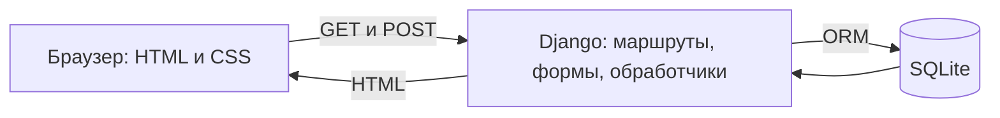
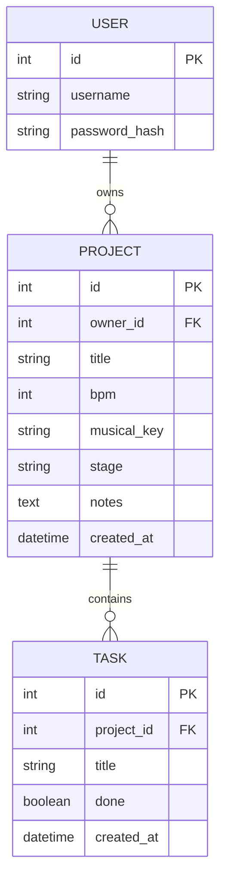

# Архитектура первой версии

Traproom — серверное приложение Django. Браузер получает HTML, отправляет формы, а сервер проверяет данные и сохраняет их в SQLite. Отдельного REST API нет: используются обычные GET и POST запросы. Локальный адрес http://127.0.0.1:8765/ не заменяет публичный деплой для сдачи.

Прогресс не хранится отдельным полем: это округлённая доля выполненных задач, умноженная на 100. Если задач нет — 0%. Этап «Готово» задаёт автор; он не меняется автоматически при выполнении задач.

## Сценарии для демонстрации

1. Войти: ввести учётные данные → открыть список только собственных проектов.
2. Создать трек: заполнить название и BPM → сохранить → увидеть карточку с параметрами.
3. Управлять задачами: добавить две задачи → отметить одну → получить 50% выполнения → обновить страницу и проверить сохранение.
4. Изменить этап: открыть редактирование → выбрать «Сведение» → сохранить → найти проект фильтром «Сведение».

## Основа таблицы соответствия

После публикации относительные пути заменить полными ссылками GitHub и деплоя.

| Функция | Код | Локальный экран |
|---|---|---|
| Вход и выход | studio/urls.py, templates/registration/login.html | /login/ |
| Список и фильтр проектов | tracks/views.py: projects | / и /?stage=mixing |
| Создание проекта | tracks/forms.py, tracks/views.py: project_form | /projects/new/ |
| Редактирование параметров и заметок | tracks/models.py, tracks/views.py: project_form | /projects/1/edit/ |
| Просмотр задач, добавление | tracks/views.py: project_detail | /projects/1/ |
| Выполнение и возврат задачи | tracks/views.py: task_toggle | /projects/1/ |
| Изменение задачи | tracks/views.py: task_edit | /tasks/1/edit/ |
| Удаление задачи | tracks/views.py: task_delete | /tasks/1/delete/ |
| Удаление проекта с задачами | tracks/views.py: project_delete | /projects/1/delete/ |
| Расчёт прогресса | tracks/models.py: Project.progress | /projects/1/ |

Номера 1 — примеры для начальных демонстрационных записей, не универсальные адреса. Перед сдачей проверить ссылки на актуальные записи.

## Проверки первой версии

12 автоматических тестов в tracks/tests.py прошли 18 сентября 2026. Проверены основные операции, разделение данных пользователей, ограничения BPM, пустые задачи, CSRF и экранирование HTML. Ручная проверка браузером подтвердила вход и изменение прогресса 50% → 75% → 50%. Это не полный аудит безопасности и не тест публичного размещения.
